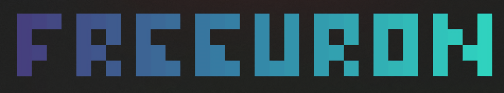
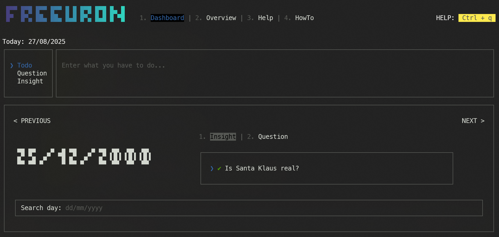
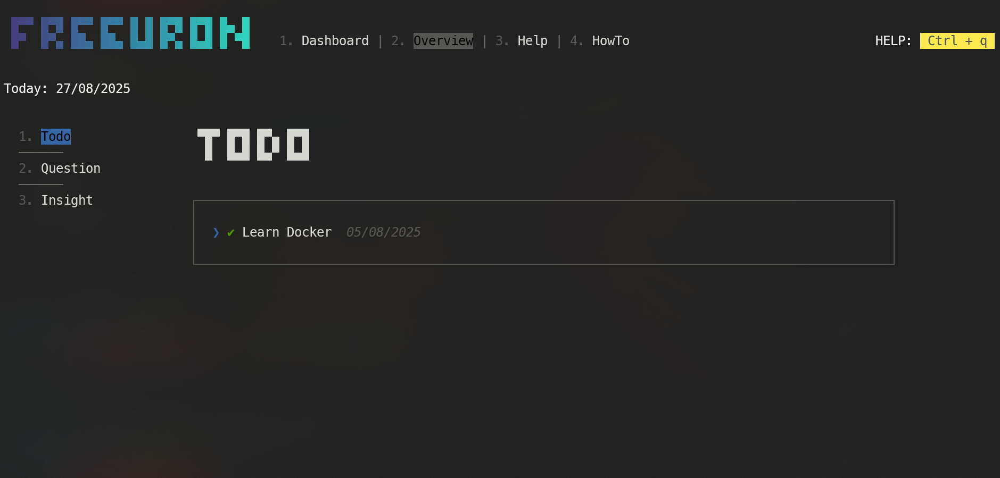
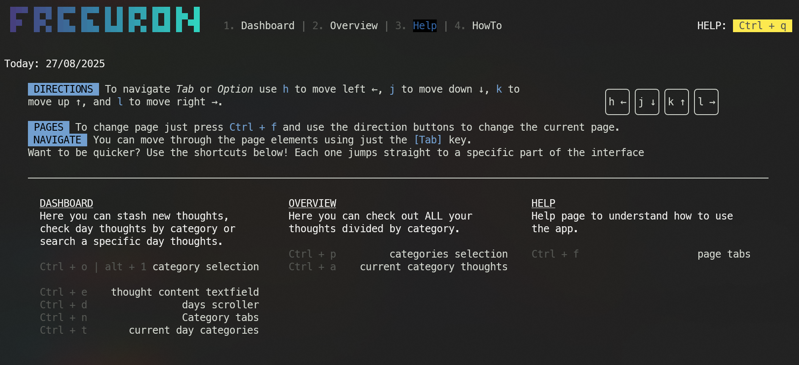
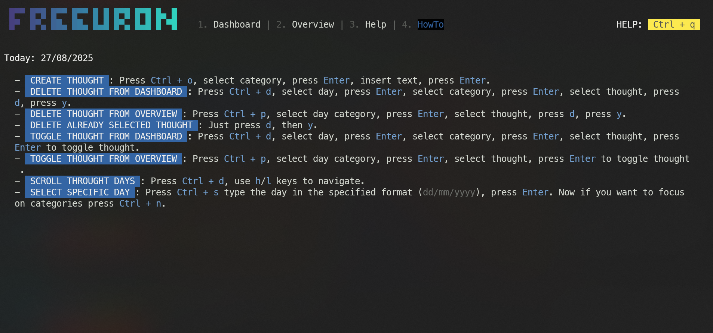

# Freeuron

Don't stop your workflow to write a note on a piece of paper, just switch a window and categorize your thought.

Free your brain, free your neurons...



- [Purpose](#purpose)
- [Install](#install)

## Purpose

I built this app because I get distracted easily. Whenever a thought pops up, I feel the urge to follow it. I needed a way to give dignity to those intrusive thoughts while still keeping my workflow free from interruptions.

With **Freeuron** I can save my thoughts and categorize them, in order to get back to them whenever I want more easily. I don't grab my notebook, break out _the zone_, and leave a vague note. I type the thought in the app, tag it, and return to my work.

Freeuron becomes a part of the workflow, not something that stalls it.

## Requirements

- **Node.js** version `16` or higher

## Install

```bash
npm install --global freeuron
```

## Design

There are two ways you can work with freeuron:

1. using the `Tab` key
2. using shortcuts

The first option is super fast to learn (you already use it in your daily life... I guess), but the job you get done is quite slow.

The second option is the way to go, in my opinion. It requires a gentle learning curve, but it's absolutely worth it.

## Help

If you are confused or you forget something you can _ALWAYS_ type `Ctrl + q`, whenever and wherever you are. It brings you to the `Help Page` where all the keys are explained.

## Pages

### How to Navigate Pages

In order to navigate through Freeuron pages you can type `Ctrl + f` and use the keys `h`/`j` to go to the previous page, and `k`/`l` to move to the next page.

### Dashboard Page (Default)

This is the first page you see when entering Freeuron. On this page you can:

- save and categorize thoughts
- navigate through days to check previous thoughts
- visualize all the thoughts of a specific day by searching for that day



### Overview Page

On this page you can visualize _ALL_ the thoughts by category. You can view all your todos, all your questions or all your insights.



### Help Page

On this page you can view all the shortcuts and how to navigate Freeuron. You can access this page everywhere in the app just by pressing `Ctrl + q`.



### How-To Page

Here you’ll find step-by-step explanations for common actions.



## Customize Categories

All categories are stored in the `~/.freeuron/config.json` file. To add or remove a category, simply edit this file and restart Freeuron.

Each category must have a `name` and a `placeholder`, which is displayed in the empty text field.

## Known Bugs

Unfortunately, I haven’t been able to replicate the following bugs, so I couldn’t fix them:

- The `Ctrl + o` shortcut doesn’t work when a thought is created (couldn’t replicate).
- Sometimes the `Ctrl + p` shortcut doesn’t work. You must press `Ctrl + f` and select another page to reset the focus.

### Limitations

- Checking or deleting a thought in the Dashboard resets the pointer to the beginning of the list.
- Creating too many thoughts in a single day can break the interface (re-rendering glitch). Possible fix: add pagination.

## Contributing

Want to help improve Freeuron? Contributions are welcome! You can:

- Report bugs or suggest features via GitHub Issues.
- Fork the repo, make changes, and submit a pull request.
- Improve documentation, examples, or add new shortcuts.

Please follow the existing code style (TypeScript `^5.0.3`+ React `^10.9.1`) and write clear commit messages.
